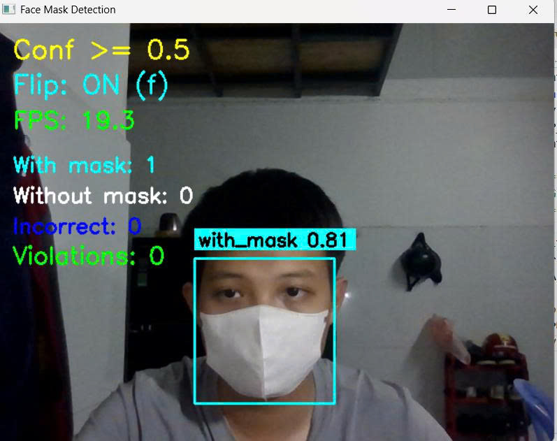
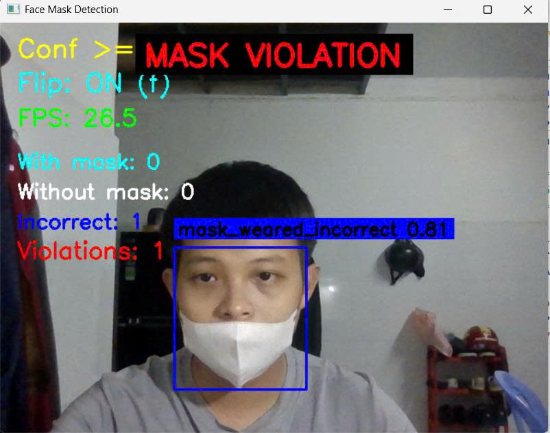
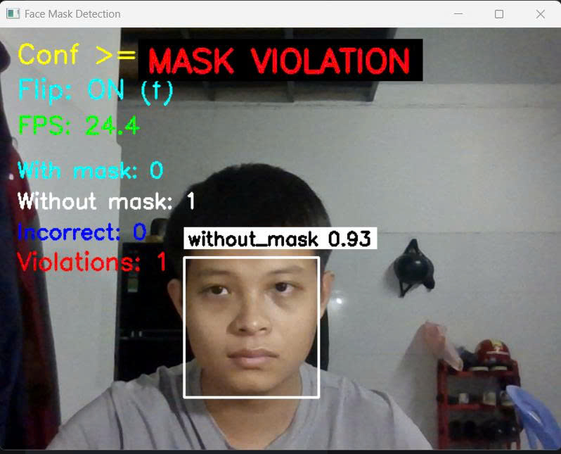

# Mask Alert Zalo

Full-stack real-time mask violation monitoring system built with FastAPI, React, ONNX Runtime, Google Cloud, and Zalo Bot integration.

This project detects mask violations from uploaded images and live webcam frames, tracks continuous violations over time, stores alert records, uploads annotated evidence images, and sends notifications through Zalo when configured thresholds are reached.

## Highlights

- Built a full-stack monitoring system with `FastAPI` backend and `React` frontend
- Ran `ONNX Runtime` inference for mask compliance detection on uploaded images and realtime webcam frames
- Implemented threshold, grace-period, and cooldown logic to control alert quality and reduce duplicate notifications
- Integrated `Zalo Bot` for automated text and image-based alerts
- Deployed on Google Cloud using `Cloud Run`, `Cloud SQL`, `Firebase`, and `Cloud Storage`
- Added backend tests for prediction, webhook, and service flows

## Demo







[Watch demo on YouTube](https://youtu.be/A_NfsMDPsY4)

## Deployment

Production-style deployment uses:

- `Cloud Run` for backend container hosting
- `Cloud SQL` for relational data storage
- `Firebase` for frontend hosting
- `Cloud Storage` for annotated alert image storage
- backend APIs and services for inference, alert creation, and notification delivery

## System Overview

### Frontend

The React frontend provides:

- realtime webcam monitoring
- manual image upload for one-off checks
- live status, detections, and alert feedback

### Backend

The FastAPI backend provides:

- `/predict` for single-image inference
- `/predict-frame` for realtime monitoring
- `/webhook/zalo` for webhook verification and user capture
- alert persistence, cooldown control, and optional media upload

## Alert Flow

1. The frontend uploads an image or sends realtime webcam frames.
2. The backend runs ONNX inference and post-processes detections.
3. The realtime state service tracks how long a violation remains active.
4. When the configured threshold is reached, an alert is created.
5. The system stores the alert, optionally uploads an annotated image, and optionally sends a Zalo notification.

## Tech Stack

- Python
- FastAPI
- SQLAlchemy
- Cloud SQL
- ONNX Runtime
- OpenCV
- React
- Vite
- Firebase
- Axios
- Google Cloud Run
- Google Cloud Storage
- Zalo Bot API
- Pytest

## How To Run

### Backend

```bash
cd backend
pip install -r requirements.txt
uvicorn app.main:app --reload
```

### Frontend

```bash
cd frontend
npm install
npm run dev
```

## CV Summary

> Built and deployed a full-stack mask violation monitoring system using FastAPI, React, ONNX Runtime, Cloud Run, Cloud SQL, Firebase, Cloud Storage, and Zalo Bot integration, enabling realtime webcam detection, alert persistence, and automated notification delivery.

Short version:

> Developed and deployed a realtime mask detection and alerting system on Google Cloud with Zalo notification integration.

## Author

**Le Thanh Hai**

- GitHub: [ThanhHaipear](https://github.com/ThanhHaipear)
